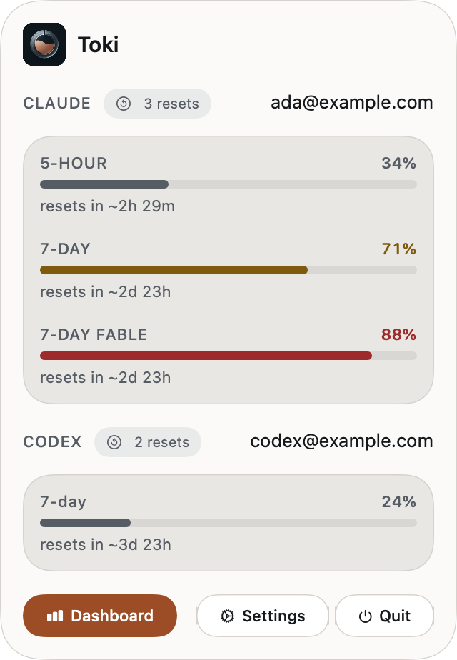
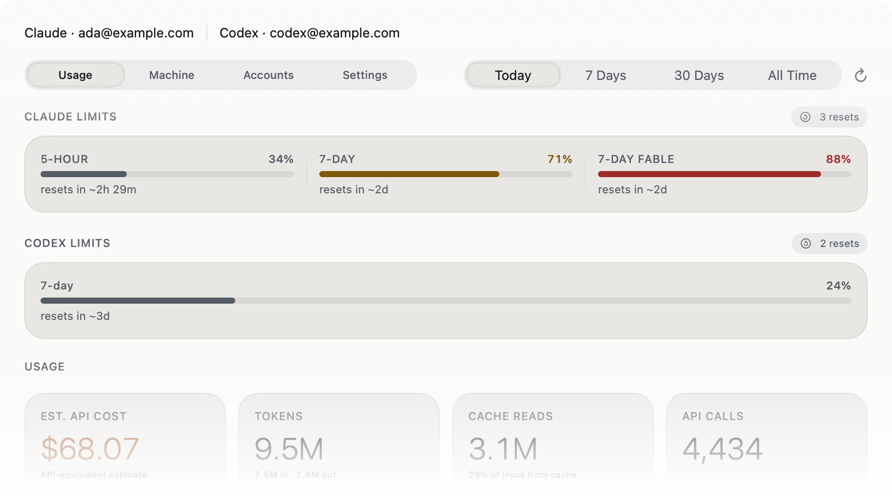
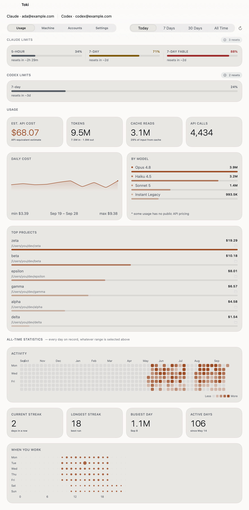

<h1> Toki</h1>

See your Claude Code and Codex limits in one quiet place. Toki lives in your Mac menu bar, with a dashboard for the bigger picture.

<p>
  <a href="https://github.com/TemMax/toki/releases/latest"><strong>Download Toki</strong></a>
  · <a href="#verify-a-release">Verify a release</a>
  · <a href="docs/build-from-source.md">Build from source</a>
</p>

macOS 14 or later · Apple Silicon

## See Toki at work

**A highly customizable menu bar.** Choose the limits, labels, bars and numbers you want to see. One click opens the full picture.

<p align="center">
  <br>
  <picture>
    <source media="(prefers-color-scheme: dark)" srcset="assets/popover-dark.png">
    
  </picture>
</p>

**A dashboard for the bigger picture.** Explore your usage, projects, models and activity over time.

<p align="center">
  <picture>
    <source media="(prefers-color-scheme: dark)" srcset="assets/dashboard-preview-dark.png">
    
  </picture>
</p>

<details>
  <summary>See the full popover and dashboard</summary>
  <p align="center">
    <picture>
      <source media="(prefers-color-scheme: dark)" srcset="assets/popover-dark.png">
      
    </picture>
  </p>
  <p align="center">
    <picture>
      <source media="(prefers-color-scheme: dark)" srcset="assets/dashboard-dark.png">
      
    </picture>
  </p>
</details>

*Screenshots use demonstration accounts, settings and usage data.*

## Features

- **Live Claude Code and Codex limits.** See five-hour, weekly and model-specific windows with reset countdowns when the provider reports them.
- **Fresh Claude usage while you work.** An optional Claude Code status-line integration keeps the main usage windows current after replies.
- **Highly customizable menu bar.** Choose which limits appear, reorder them, and show each as a bar, number or both with optional labels.
- **Usage analytics.** Explore tokens, API calls, projects, models and estimated API-equivalent spend from local transcripts. Estimates are not your provider's bill.
- **Generation speed.** Compare output tokens per second by model, effort and Fast mode, and see how each has changed over time.
- **Activity history.** See a year of daily activity, streaks, busiest days and the hours when you work.
- **Multiple accounts.** Save and switch Claude Code and Codex accounts independently, with each account's limits kept separate.
- **Optional AutoSwap.** Set a threshold and cooldown for each provider to move to another saved account as a limit approaches.
- **Reset balances.** See saved Claude resets and available Codex banked resets, including known eligibility and expiry details.
- **Notifications.** Choose limit-threshold alerts, reset announcements, account events and provider incident notices.
- **Service health.** See relevant Claude and Codex incidents in the app, with links to the provider's status details.
- **More local context.** Inspect Claude Code sessions and the installed Claude/Codex environment from the dashboard.
- **Local transcript history.** Toki indexes active and archived transcripts on your Mac for its charts and breakdowns.

## Get started

1. [Download the latest release](https://github.com/TemMax/toki/releases/latest) and move Toki to Applications.
2. Launch Toki from Applications, then click its menu-bar icon. If macOS asks for access to a CLI sign-in, review the prompt and allow it to show that account's usage.
3. Use your existing Claude Code or Codex sign-in. Toki shows the providers it finds on your Mac.

## Source and trust

This repository publishes reviewed source snapshots for new Toki releases. Day-to-day development and signing happen in a private repository. Each new release tag identifies the source used for that release; older releases from before this change do not have a matching public source snapshot.

Toki reads local Claude Code and Codex transcripts for its usage history and asks the providers for live limit data. The [build guide](docs/build-from-source.md) explains how to build the app from a release tag, and the [verification guide](docs/verify-release.md) explains how to compare that source with a downloaded release.

## Verify a release

For a new source-backed release, replace `vX.Y.Z` with its tag and run this on an Apple Silicon Mac with the [required build tools](docs/verify-release.md):

```sh
git clone https://github.com/TemMax/toki.git
cd toki
git checkout vX.Y.Z
bash scripts/verify-tag.sh vX.Y.Z
```

The command checks the downloaded DMG's Apple and Sparkle signatures and notarization, then compares its app code and resources with an independent build from this tag. It prints the DMG's SHA-256; compare that value with the release page yourself. The public unsigned archive has a separate build attestation. The [verification guide](docs/verify-release.md) explains how to inspect it and what the comparison covers. A checksum or attestation alone does not prove that the signed app matches the source.

## Help make Toki better

Found a problem or have an idea? [Open an issue](https://github.com/TemMax/toki/issues) or read [how to contribute](CONTRIBUTING.md). Please report vulnerabilities through [private vulnerability reporting](SECURITY.md).

Toki-owned code and the AppIcon and BrandMark artwork are available under [Apache License 2.0](LICENSE). Bundled dependencies keep their own notices, including [Sparkle's](https://github.com/TemMax/toki/blob/main/App/Resources/ThirdPartyNotices.txt). The license does not grant trademark rights in the Toki name or logo.
